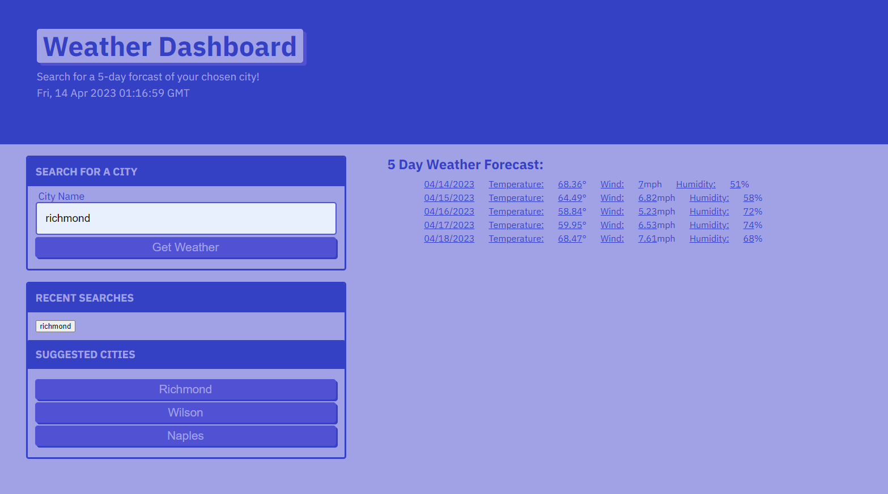

# ELL Weather Dashboard

## Description

I wanted to take the tools I have learned in class using web APIs to create this functioning app that allowsa user to view a 5-day weather forcast for whichever city they would like! It is an easy to use site that is user-friendly. A user is prompted to input a city and they are then given the temperature, wind, and humidity of that city for the next 5 days!

## Installation

No installation is required. 

## Usage

The [website](https://elizabeth189.github.io/ELLWetherDash/) is accessible here for you to use. 

## License

Please refer to the LICENSE in the repo.